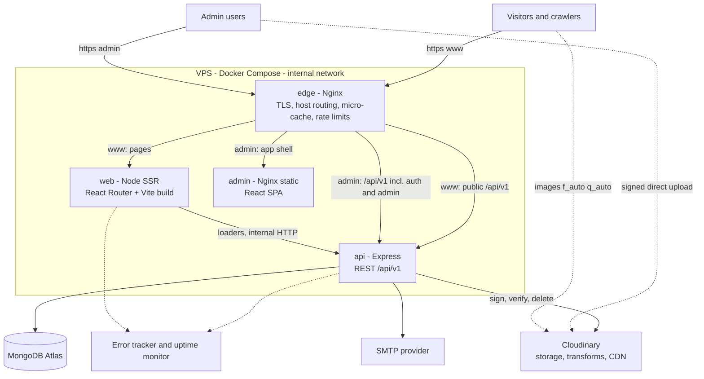
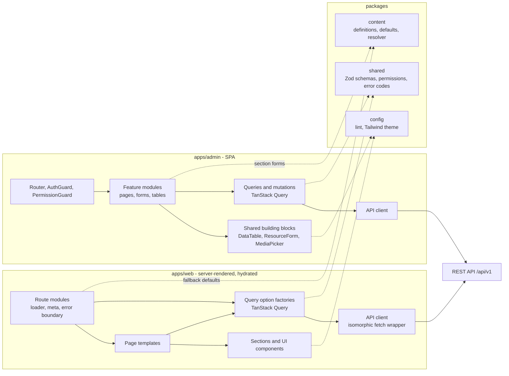
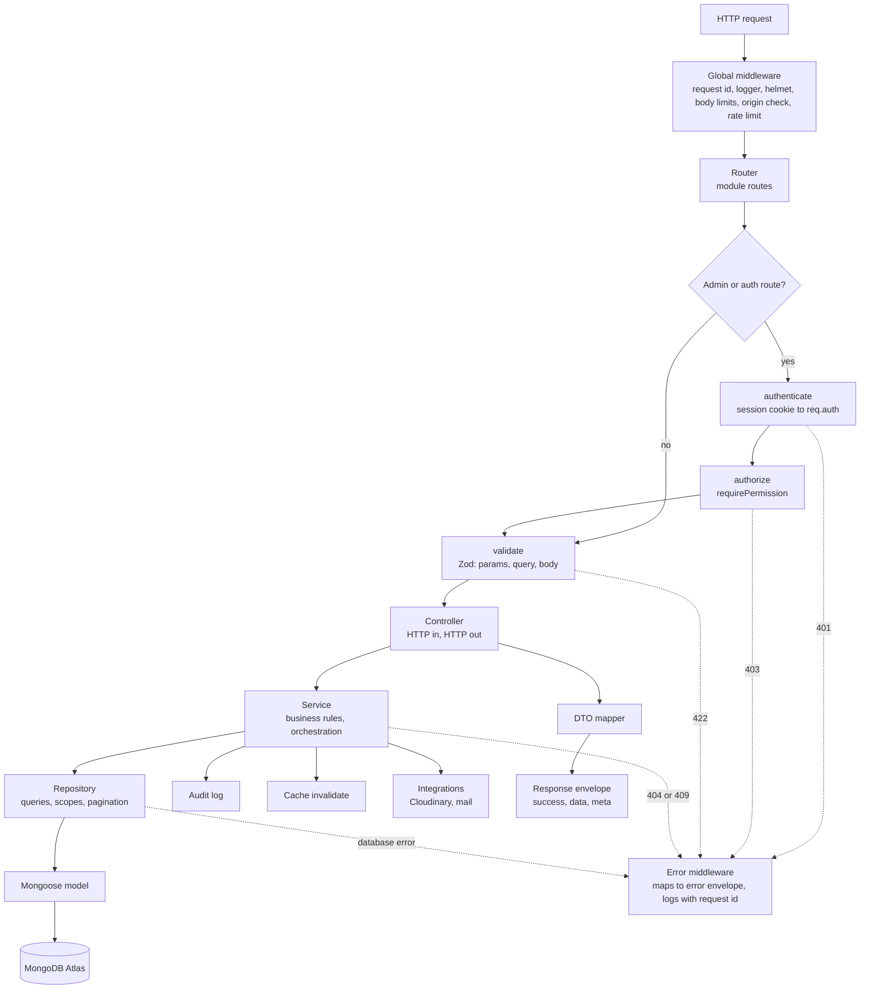
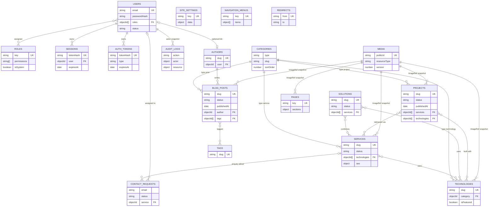
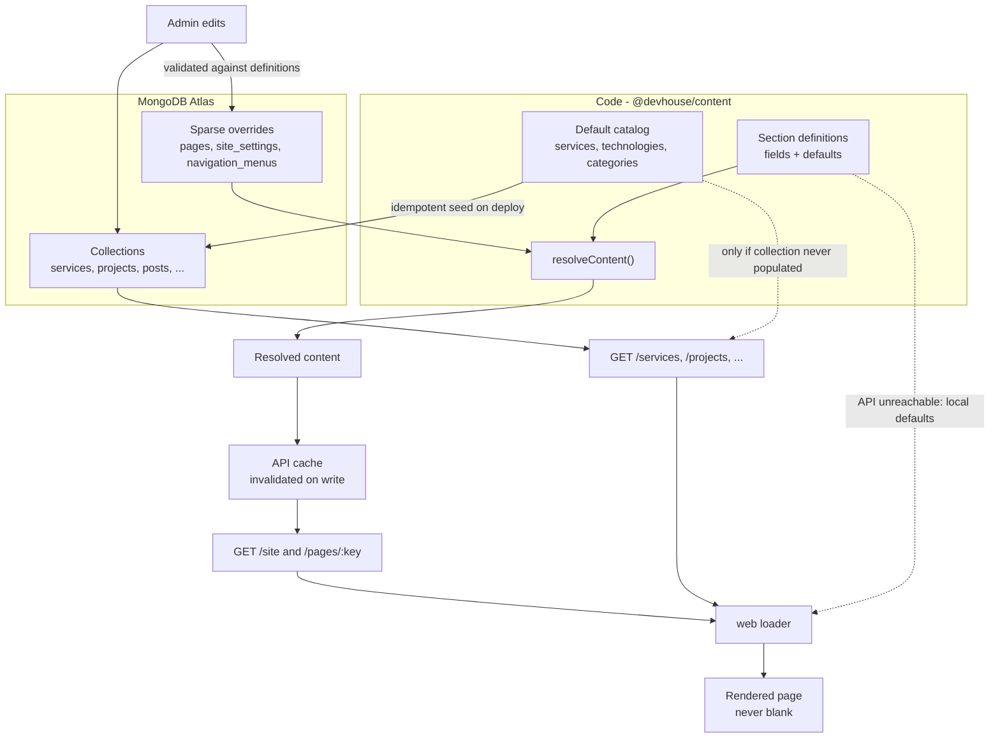
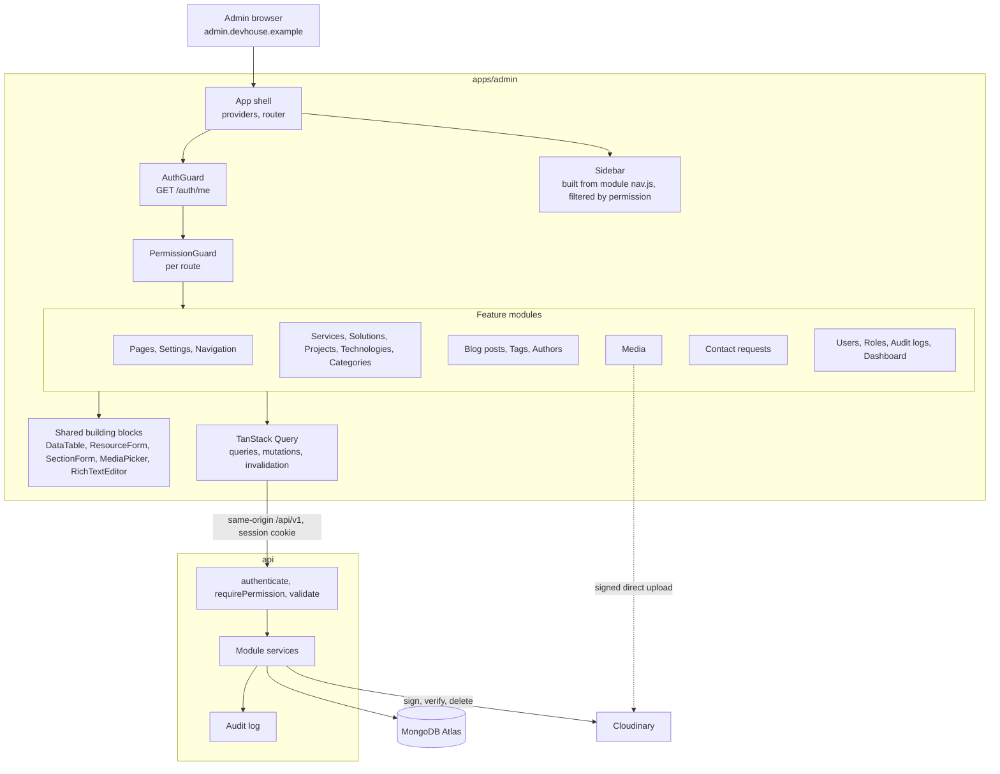
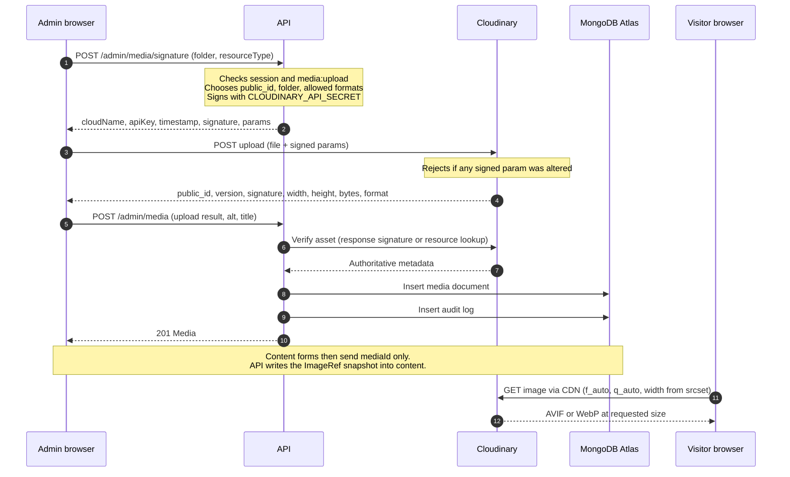
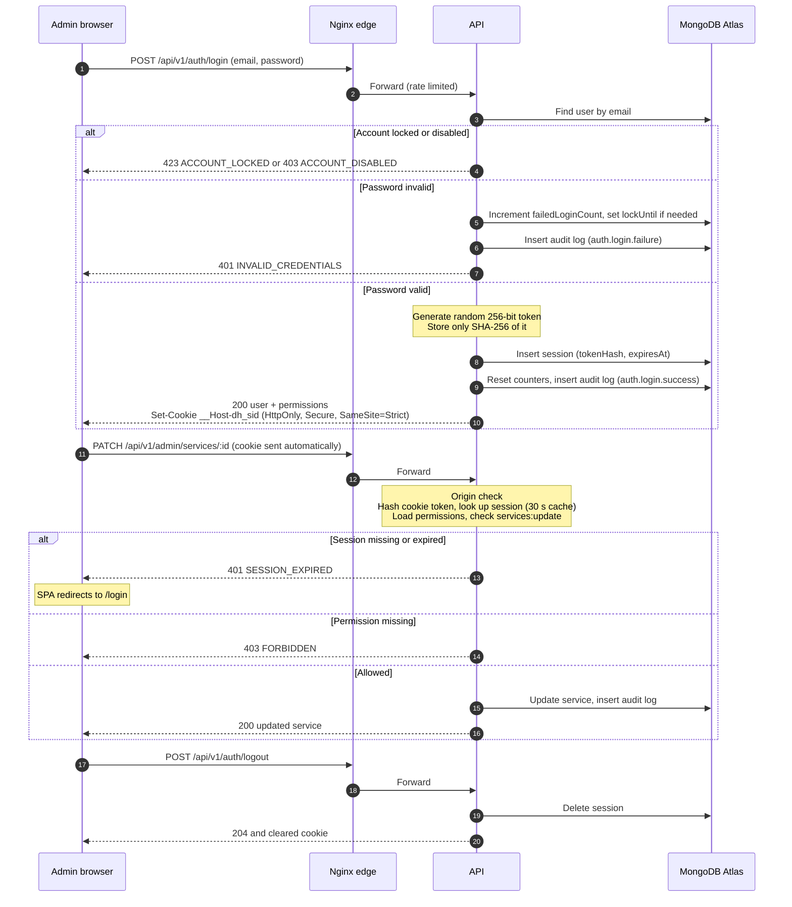
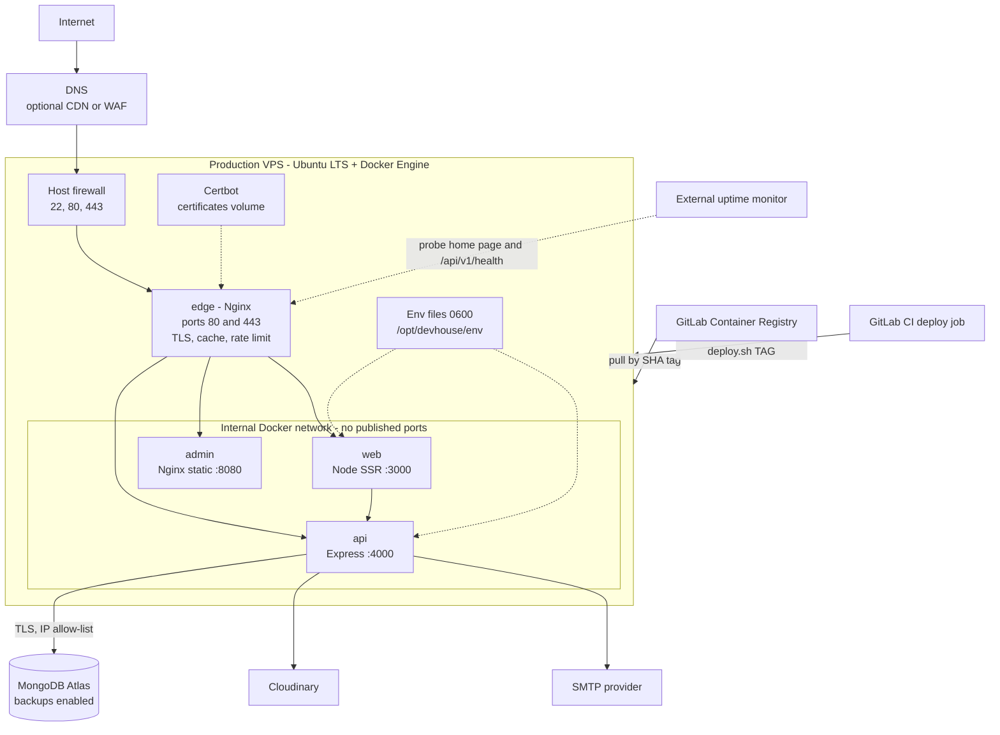
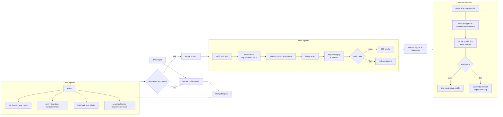

# Part I — Mermaid Diagrams (§43)

[← Index](README.md)

GitLab renders these diagrams natively in Markdown.

## 43. Mermaid Diagrams

### 43.1 High-level system architecture

### 43.2 Frontend architecture

### 43.3 Backend request flow

### 43.4 Database architecture

### 43.5 Content resolution architecture

### 43.6 Admin architecture

### 43.7 Cloudinary upload architecture

### 43.8 Authentication flow

### 43.9 Production deployment

### 43.10 GitLab CI/CD pipeline

